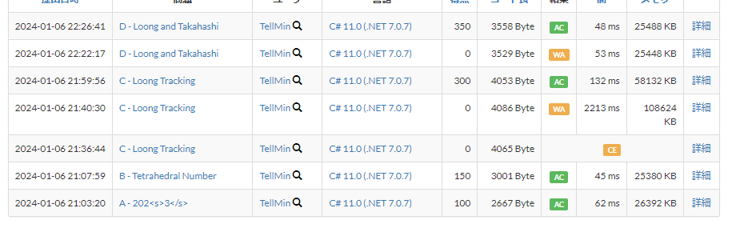

## Table of Contents

## 結果



初めて A, B, C, D の4完ができました。難易度としては低めで、データ構造やアルゴリズムの知識よりも発想力で解ける問題が多かったです。

## A - 202<s>3</s>

一番最後の文字を`2024`に置き換えるという問題です。ただし文中の`2023`を`2024`に置き換えてはいけません。

私は文字列の配列として扱い、逆順にして先頭を"4"に置換することで解きました。

## B - Tetrahedral Number

N = 21 のとき N^3 = 9261 で、計算量的にも問題ありません。愚直にループを書くことで実現可能です。

```csharp
for(int i = 0; i <= N; i++)
{
    for(int j = 0; j <= N; j++)
    {
        for (int k = 0; k <= N; k++)
        {
            if(i + j + k <= N)
            {
                WriteLine($"{i} {j} {k}");
            }
        }
    }
}
```

### C

私は点1の移動経路をメモし、メモ範囲内の点を出力することで解きました。

メモ範囲外の点については都度計算することで解きましたが、
点1以外の点についても (3,0) -> (2,0) -> (1,0) のように (n,0) から移動したとして扱うことで、不要な処理を削減できたと思います。

X では deque を使った解法が紹介されていて話題になっていました。（言語によって計算量が異なる）

C#の場合、Queue<T>.Dequeue メソッド の計算量については

> このメソッドは、O(1) 操作です。

と明記してありました。

https://learn.microsoft.com/ja-jp/dotnet/api/system.collections.generic.queue-1.dequeue?view=net-8.0

後日再実装したいと思います。

↓ 私の解答

```csharp
var N = cin.ReadInt;
var Q = cin.ReadInt;

var dots = new List<(int x, int y)>();
dots.Add((1, 0));

for (int i = 0; i < Q; i++)
{
    var tasks = cin.ReadStrArray(2);
    var task = tasks[0];
    var content = tasks[1];

    if (task == "2")
    {
        var intContent = int.Parse(content);
        if (intContent == 1)
        {
            var dot = dots.Last();
            Console.WriteLine($"{dot.x} {dot.y}");
            continue;
        }

        var diff = dots.Count - intContent;
        if (diff > 0)
        {
            var dot = dots.ElementAt(dots.Count - 1 -  (intContent - 1));
            Console.WriteLine($"{dot.x} {dot.y}");
        }
        else
        {
            Console.WriteLine($"{1 - diff} 0");
        }
    }
    else
    {
        var last = dots.Last();

        if (content == "R")
        {
            dots.Add((last.x + 1, last.y));
        }
        else if (content == "L")
        {
            dots.Add((last.x - 1, last.y));
        }
        else if (content == "U")
        {
            dots.Add((last.x, last.y + 1));
        }
        else if (content == "D")
        {
            dots.Add((last.x, last.y - 1));
        }
    }
}
```

### D - Loong and Takahashi

渦巻問題。

以下のような進行方向を定義する配列を準備しておくと実装が楽になります。

```csharp
var direction = new (int x, int y)[] { (1, 0), (0, -1), (-1, 0), (0, 1) };
var directionIndex = 0;

// 処理中に、方向転換する場合
directionIndex = (directionIndex + 1) % 4;
```

4 で mod を取ることで、配列の範囲外になることを防ぎます。

余談ですが、ユーザー解説があまりにもパワープレイで解いていて面白かったです。

https://atcoder.jp/contests/abc335/editorial/9035

## まとめ

精進頑張ります。
