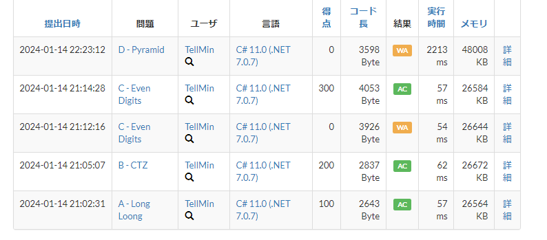
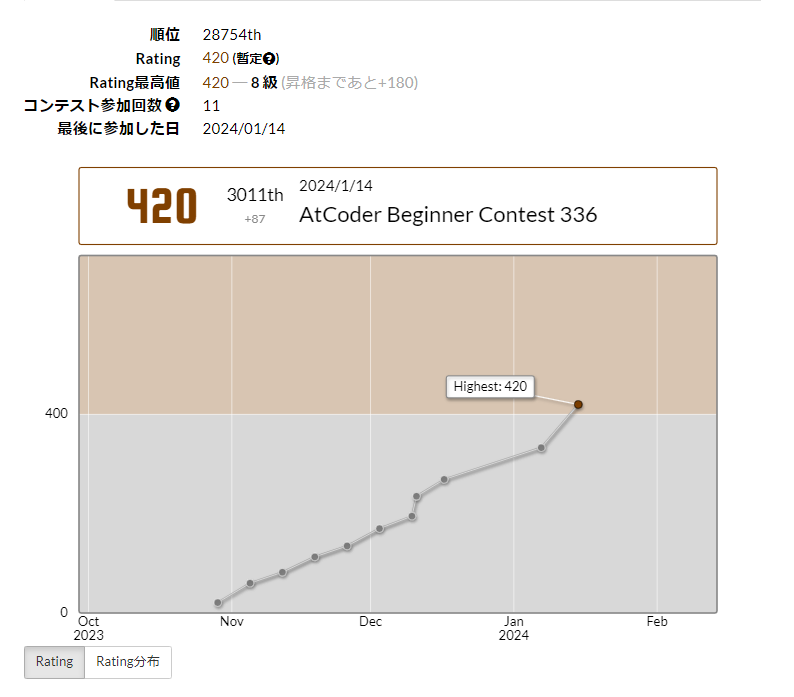

## Table of Contents

## 結果



結果は A,B,Cの三完でした。ABCまでサクサク解けていただけに、D問題が解けなかったのは残念でした。

が！！！！！



茶色に到達しました～！目標は緑色になることですが、まずは一つ節目を迎えられて嬉しいです。

では、問題の振り返りをしていきます。

## A - Long Loong

シンプルにfor文で `o` の文字を出力しました。
ただ、目的の数字の数だけイテレートを回して何か操作をするコードをさっと書けるようにしておくと、汎用性が高そうです。

また、回答例にシンプルで美しいコードがありました。

```csharp
$"L{new string('o', n)}ng";
```

まだまだ勉強が足らんですな。

## B - CTZ

これは C 問題 の布石でもありましたね。
単純に2進数に変換するだけなら、以下のように書けます。

```csharp
Convert.ToString(n, 2);
```

今回は後ろから評価してあげたいので、Reverse して順に数え上げれば良いです。

```csharp
var N = cin.ReadLong;
var binary = Convert.ToString(N, 2);

var revert = binary.Reverse().ToArray();

var count = 0;

for (int i = 0; i < revert.Length; i++)
{
    if (revert[i] == '0')
    {
        count++;
    }
    else
    {
        break;
    }
}

Console.WriteLine(count);
```

## C - Even Digits

これは5進数として考えると解けます。
10進数からn進数に変換する場合、nで割った余りを順に並べていけば変換できます。

```csharp
var ans = new System.Text.StringBuilder();
while (N != 0)
{
    var r = N % 5;
    N /= 5;
    ans.Append(r);
}
```

後はそれぞれ対応する数字を出力すれば良いです。

## まとめ

D問に1時間取り組む時間があったにも関わらず、解けなかったのは悔しいです。

DPに対する実践が不足していることが分かりましたので、精進あるのみです。
